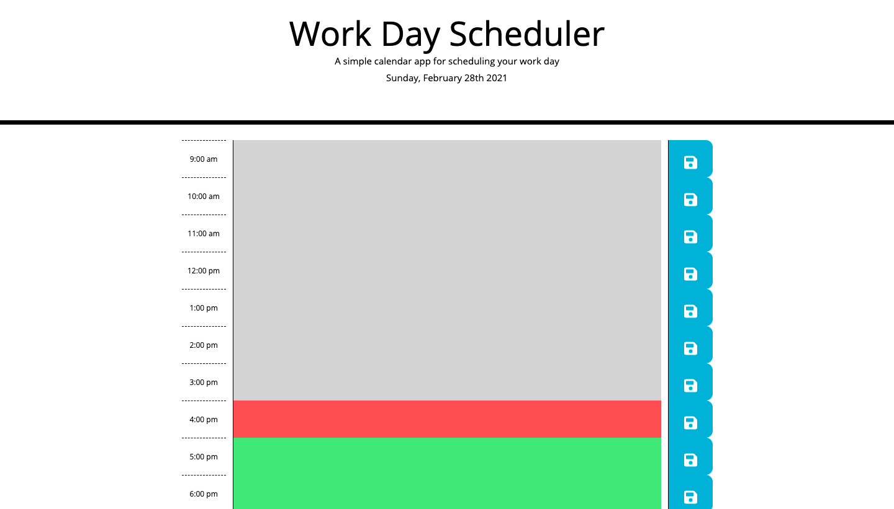

# Work Day Scheduler
This webpage presents a daily schedule that allows users to save events to different hour blocks and tells them which hours have past, which hour is current, and which hours are in the future.
## Features
- Current day presented in header
- Editable text area for setting customizable events.
- Save buttons for saving events to local storage.
- Color-coded time blocks to tell users when an hour is past(grey), current(red), or future(green).

link: 
